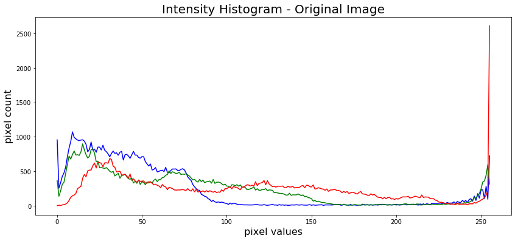
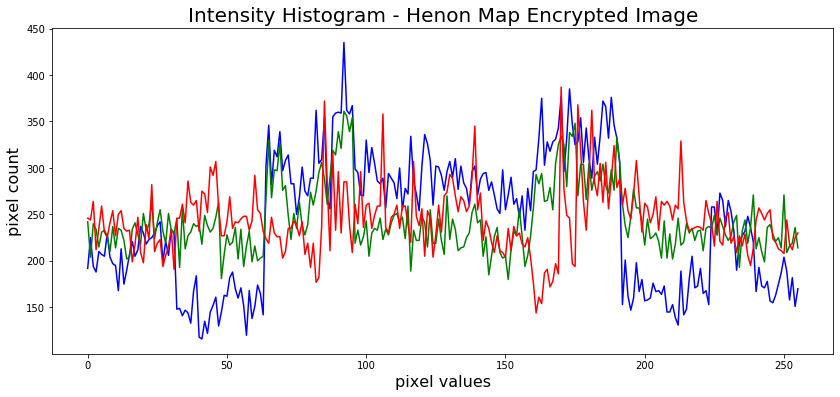
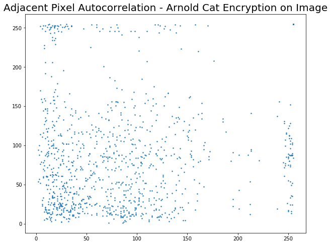

# Image Encryption Research Project

# Image Encryption and Decryption using Chaos Maps and Histogram Analysis

## Overview
This repository contains the work of my research project on Image Encryption. The goal of this project is to explore and implement various image encryption techniques for enhancing the security of digital images.

This is a project in cryptography that involves implementing image encryption using various chaos maps and comparing their merits based on key sensitivity, adjacent pixel autocorrelation and intensity histograms. The chaos maps implemented were - Arnold cat maps, Henon maps and Logistic chaos maps.

## Description
Digital images are widely used and it is crucial to protect the confidential image data from unauthorized access. This project explores various encryption techniques to secure digital images.

### What are chaos maps?
- Chaos maps are mathematical functions that generate a highly arbitrary pattern based on the initial seed value. 
- They are used in the generation of pseudo-random numbers and in multimedia encryption. 
- Chaos maps widely used in building pseudo-random number generators and in multimedia encryption to their chaotic behavior, which is determined by the initial seed conditions and is highly sensitive to small changes in the seed value. 
- They can have up to four dimensions and can vary in the number of seed points. 
- Chaotic maps are used in various applications such as digital marketing, chaotic system simulation, chaotic missile systems, and online security for banking and e-commerce.

### Why Chaos Maps for encryption?
- Chaos maps are used for encryption because of their unique properties such as determinacy, ergodicity, and sensitivity to initial conditions. 
- These properties are similar to the confusion and diffusion properties required for a good cryptosystem. 
- Chaotic systems can generate evenly diffused random keys that hide the image information in the cipher images, making them suitable for encrypting images. 
- Additionally, chaotic cryptography provides several advantages over conventional cryptographic methods, such as increased flexibility, high security, less computational overheads, less computing power, and ease of implementation. 
- Chaotic cryptography is also more suitable for real-time image encryption due to its lower mathematical complexity and better security.

## Features
- Implementation of various image encryption techniques.
- Detailed analysis and comparison of the techniques.
- Well-documented code for understanding and further development.

## Implementation

### Encrypted Images

#### Image after Arnold Cat Encryption

#### Image after Henon Map Encryption

#### Image after Logistic Map Encryption

## Intensity Histogram

The ciphertext image histogram analysis is one of the most straight-forward methods ofillustrating the image encryption quality. A good image encryption method tends to encrypt a plaintext image to a random incomprehensible form. Thus a good image encyption technique generates a cipher image that has a uniformly distributed intensity histogram.

## Adjacent Pixel Autocorrelation

Since images exhibit high information redundancy, it is desirable to have an encryption algorithm that breaks this redundancy. Thus as a metric of encryption performance we find the correlation between adjacent pixels in a direction (Horizontal, Vertical or Diagonal). We have considered the Horizontal direction. 

1024 random pixels are picked up from the image and its correlation between it's rightmost neighbour is found and plotted. For a good algorithm, the correlation plot should appear random with no discernable pattern.

 

## Key Sensitivity
An ideal image encryption algorithm should be sensitive with respect to thesecret key i.e a small change in the key should produce a completely differentencrypted image.To test the key sensitivity the we encrypt the plain image with the threealgorithms. We then try decrypting them with a slightly changed key.
### Arnold Cat
#### Original Image

#### Encrypted with key = 20

#### Decrypted with key = 19

### Henon Map
#### Original Image

#### Encrypted with key = (0.1, 0.1)

#### Decrypted with key = (0.1, 0.101)

### Logistic Map
#### Original Image

#### Encrypted with key = "supersecretke"

#### Decrypted with key = "supersecretkd"

## Technologies Used
- Language: Python
- Libraries: Numpy, Matplotlib, Pillow

## How to Use
1. Clone this repository.
2. Install the required libraries.
3. Run the main file.

## Contributing
Contributions, issues, and feature requests are welcome. Feel free to check issues page if you want to contribute.

## Author
- Shreya Parkar

